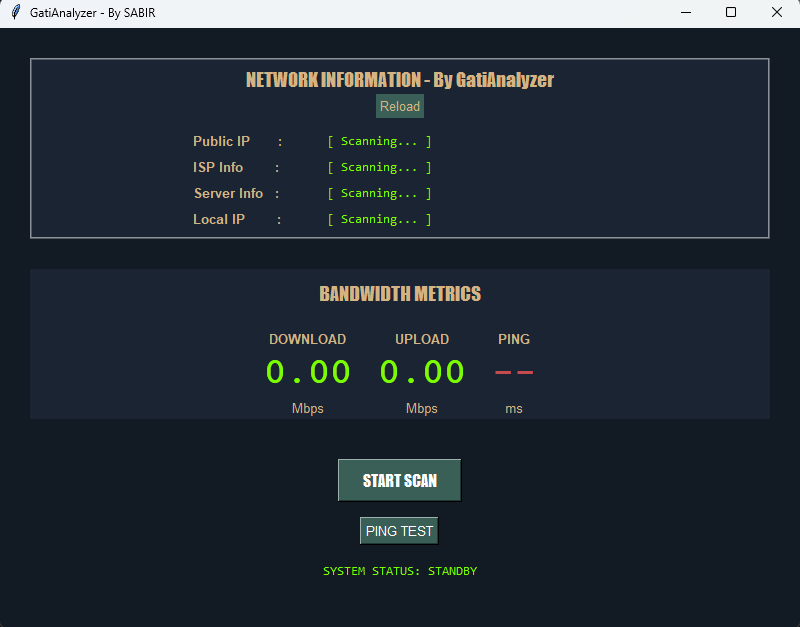

# 🚀 GatiAnalyzer

## Overview

**GatiAnalyzer** is a powerful tool designed for **network analysis and performance testing**. It is built for assess and monitor network conditions efficiently.

## 🌟 Features

### Network Analysis Features:
- 🚀 **Measure internet speed** (Download, Upload, Ping)
- 📡 **Detect local & public IP details**
- 📍 **Find ISP and server location**
- 🏹 **Perform ping tests on real-time**
- 📊 **Display network statistics in a user-friendly format**
- 🖥 **User-friendly GUI with a tactical-themed design**
---
### GUI Interface:

---
## 🛠 Installation

### 📌 Prerequisites  
Before installing, ensure you have:
- **Python 3.6+** installed 🐍  
- **Tkinter** (pre-installed with Python on most systems)  

### 📥 Installation Steps

1. **Clone the repository**  
   ```bash
   git clone https://github.com/Sabirtanvir12/GatiAnalyzer.git
   cd GatiAnalyzer
   ```  

2. **Install dependencies**  
   ```bash
   pip install speedtest-cli requests ping3 pillow
   ```
   **or**
   ```bash
   bash setup.sh
   ```
 
3. **Run the application**  
   ```bash
   python3 gati.py
   ```
  
### 💻 Windows
1. Download the ZIP file from GitHub and extract it.
2. Open the extracted folder.
3. Right-click inside the folder and select **Open in Terminal**.
4. Install dependencies:
   ```powershell
   pip install speedtest-cli requests ping3 pillow
   ```

5. Run the script using:
   ```powershell
   python3 gati.py
   ```

---
---
🚀 We welcome contributions! Feel free to **submit issues, fork the repo, or create pull requests**.

---

## 📜 License

🔒 This project is licensed under the **MIT License**. See the `LICENSE` file for more details.  

---
## ❤️ Support

If you like this project, don't forget to **⭐ star the repo**! 😊  

📧 For any queries, reach out via **[sabirtanvir10@gmail.com](mailto:sabirtanvir10@gmail.com)** or open an **issue**.  